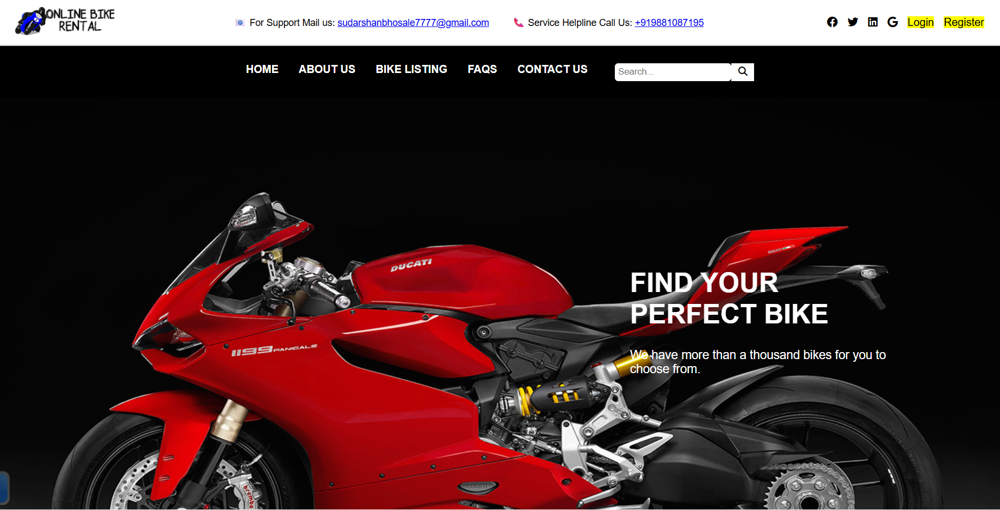
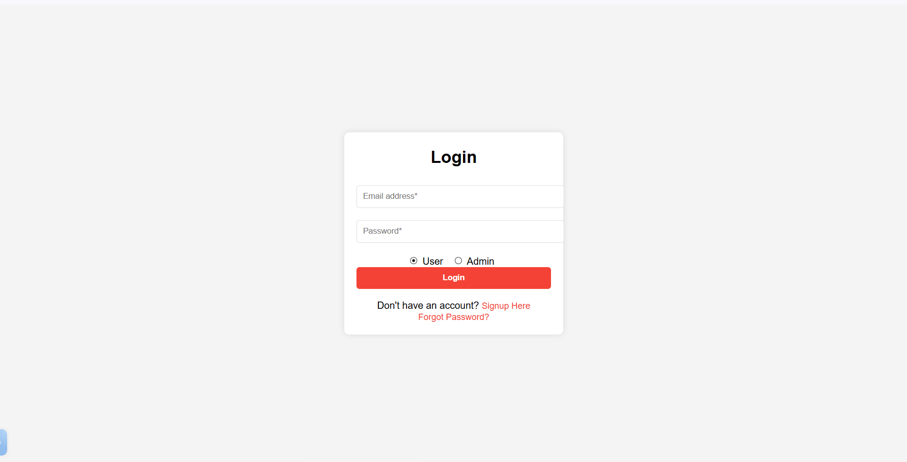
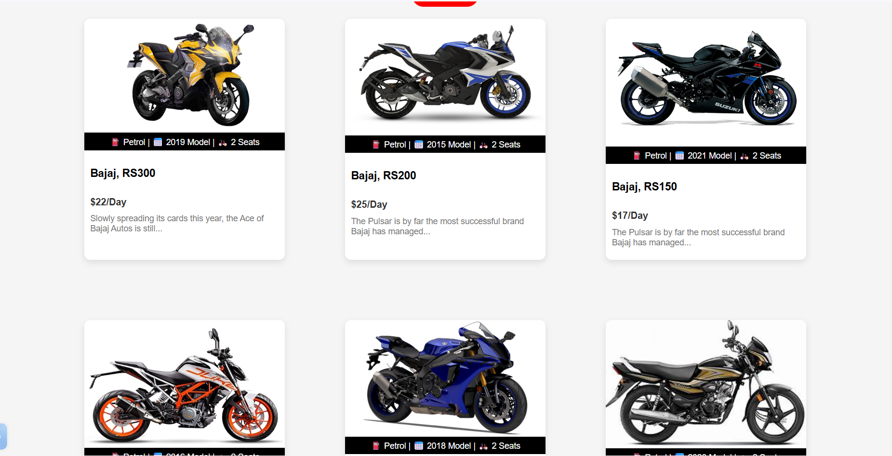

# 🚲 Bike Rental Web Application

  <b>A Full-Stack Bike Rental Platform built using Flask & MongoDB</b>

  
  
  
  
  

---

## 🌐 Live Website

👉 https://sidz-bikerental.vercel.app

---

## 📌 About The Project

The Bike Rental Web Application allows users to register, login, browse available bikes, and book rentals online.

This project demonstrates full-stack development skills including authentication, MongoDB integration, session handling, and cloud deployment on Vercel.

---

## 🛠 Tech Stack

- Backend: Flask (Python)
- Database: MongoDB Atlas
- Frontend: HTML, CSS
- Deployment: Vercel
- Version Control: Git & GitHub

---

## ✨ Features

- 🔐 User Registration & Login
- 🚲 Dynamic Bike Listings
- 📅 Booking Functionality
- 🗄 MongoDB Database Integration
- 🌍 Live Deployment
- 📱 Responsive Design

---

## 📂 Project Structure

Bikerental/
│
├── api/
├── templates/
├── static/
├── app.py
├── requirements.txt
└── vercel.json

---

## ⚙️ How To Run Locally

1. Clone the repository  
   git clone https://github.com/Sidz77/Bikerental.git

2. Install dependencies  
   pip install -r requirements.txt

3. Run the app  
   python app.py

---

## 📸 Screenshots

### 🏠 Homepage

### 🔐 Login Page

### 🚲 Bike Listing

---

## 🚀 Future Improvements

- 💳 Payment Gateway Integration
- 📧 Email Notifications
- 👨‍💼 Admin Dashboard
- 📊 Booking Analytics
- 🔐 API Security Improvements

---

## 👨‍💻 Developer

Sudarshan Bhosale  
GitHub: https://github.com/Sidz77

---

⭐ If you like this project, give it a star!

